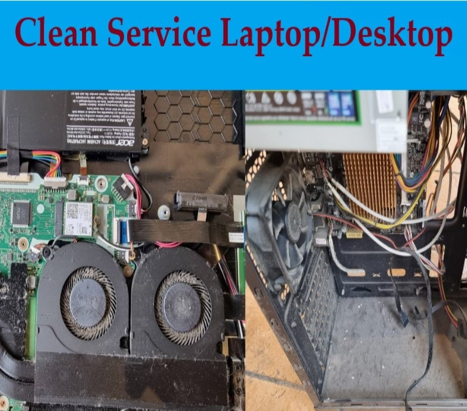
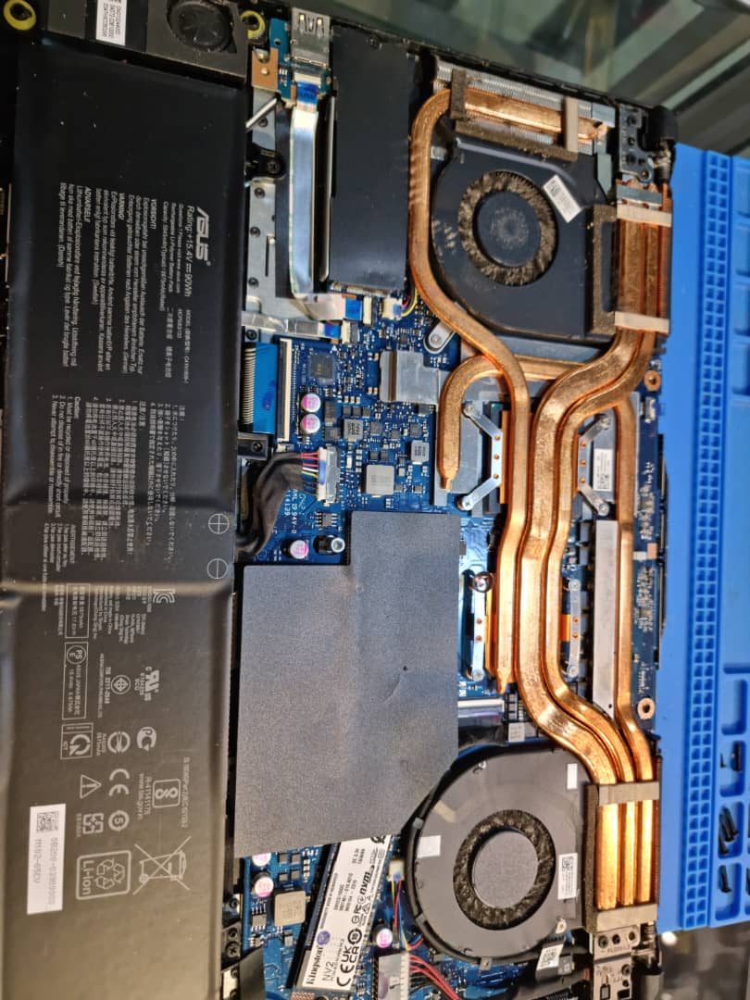
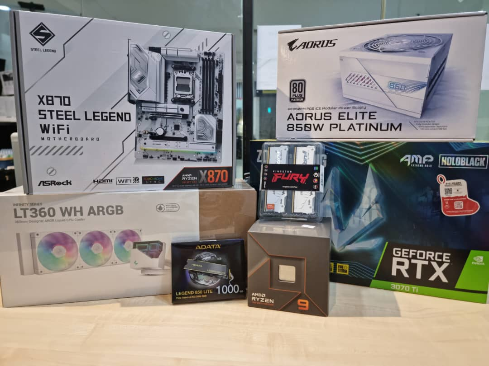
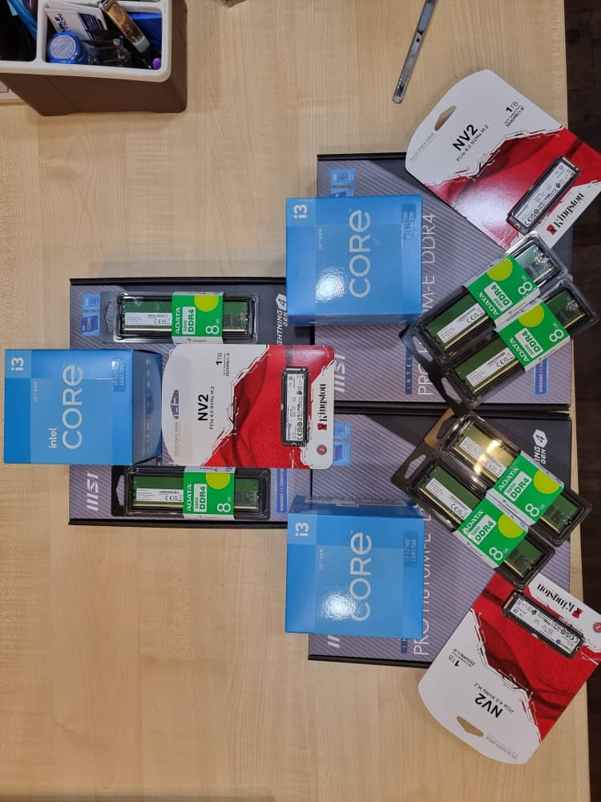

<!DOCTYPE html>
<html lang="en">
<head>
    <meta charset="UTF-8">
    <meta name="viewport" content="width=device-width, initial-scale=1.0">
    <title>COMPUTER RANGER EMPIRE</title>
    <link href="https://fonts.googleapis.com/css2?family=Orbitron:wght@700&family=Roboto:wght@400;500&display=swap" rel="stylesheet">
    
</head>
<body>
    

        <header>
            
COMPUTER RANGER EMPIRE

        </header>

        <!-- OUR SERVICES SECTION -->
        <section class="content-section">
            <h2>Our Services</h2>
            
Professional solutions for all your tech needs:

            
            <!-- Added the requested services list -->
            

                Laptop repair, Desktop Repair, Computer service, Laptop battery change, 
                laptop keyboard change, laptop screen change, Desktop parts and all type of computers services
            

            
            

                <!-- Service 1 -->
                

                    
                    
Computer Repair

                

                
                <!-- Service 2 -->
                

                    
                    
Laptop Maintenance

                

                
                <!-- Service 3 -->
                

                    
                    
Desktop New Setup

                

                
                <!-- Service 4 -->
                

                    
                    
Hardware Upgrade

                

            

        </section>

        <!-- VISIT US SECTION WITH EMBEDDED MAP ONLY -->
        <section class="content-section">
            <h2>Visit Us</h2>
            

                <iframe class="map-frame" 
                        src="https://www.google.com/maps/embed?pb=!1m18!1m12!1m3!1d3983.72253866531!2d101.6036362118593!3d3.167605453022896!2m3!1f0!2f0!3f0!3m2!1i1024!2i768!4f13.1!3m3!1m2!1s0x31cc4f8b0151d235%3A0x241608d4c67b7d1c!2sComputer%20Ranger%20Empire!5e0!3m2!1sen!2sde!4v1738426556150!5m2!1sen!2sde" 
                        allowfullscreen="" 
                        loading="lazy" 
                        referrerpolicy="no-referrer-when-downgrade">
                </iframe>
            

            
            

                <a href="https://www.google.com/maps/place/Computer+Ranger+Empire/@3.1676001,101.6062165,17z/data=!3m1!4b1!4m6!3m5!1s0x31cc4f8b0151d235:0x241608d4c67b7d1c!8m2!3d3.1676001!4d101.6062165!16s%2Fg%2F11pzw7_ky7?hl=en-GB&entry=ttu&g_ep=EgoyMDI1MDUwNy4wIKXMDSoASAFQAw%3D%3D" 
                   class="google-link" 
                   target="_blank">
                    Get Directions
                </a>
            

        </section>

        <!-- CONTACT US SECTION -->
        <section class="content-section">
            <h2>Contact Us</h2>
            

                
<strong>Phone:</strong> 
                <a href="https://wa.me/601139326396" class="whatsapp-link" target="_blank">
                    WhatsApp: +60 11-3932 6396
                </a>

                
                

                    <strong>Business Hours:</strong>
                    <table class="hours-table">
                        <tr>
                            <td>Tuesday - Sunday</td>
                            <td>10:00 AM - 8:00 PM</td>
                        </tr>
                        <tr>
                            <td>Monday</td>
                            <td>Closed</td>
                        </tr>
                    </table>
                

            

        </section>

        <footer>
            
&copy;  COMPUTER RANGER EMPIRE. All rights reserved.

        </footer>
    

</body>
</html>
